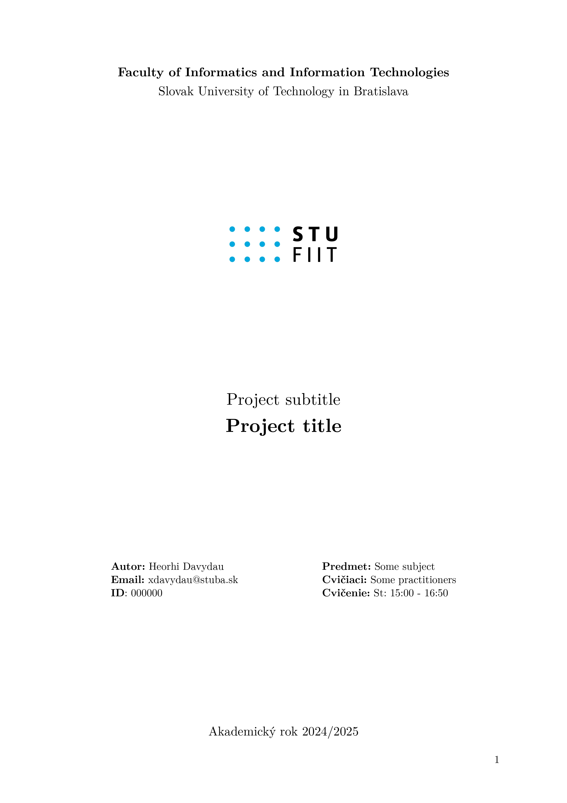

# This is a template for assignments in FIIT STU written in typst language.

## Example of usage

```typst
#import "template.typ": *

#show: project.with(
  title: "Project title",
  subtitle: "Project subtitle",
  academic-year: [2024/2025],
  author: (
    name: "Heorhi Davydau",
    email: "xdavydau@stuba.sk",
    id: "000000"
  ),
  logo: "logo_fiit.svg",
  affiliation: (
    university: "Slovak University of Technology in Bratislava",
    faculty: "Faculty of Informatics and Information Technologies",
  ),
  assignment: (
    subject: "Some subject",
    practitioners: "Some practitioners",
    exercise_time: "St: 15:00 - 16:50",
  ),
)
```


